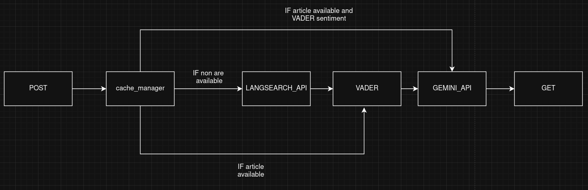

# Market Sentiment Service

Production-grade FastAPI microservice for analyzing cryptocurrency market sentiment using web data sources.



## Overview

This service fetches public crypto-related content from **LangSearch API**, analyzes sentiment using **VADER**, and uses **Google Gemini** to generate human-readable summaries. It provides structured JSON responses with sentiment classification, confidence scores, and cited sources.

**Important**: This service does NOT provide financial advice. It only summarizes publicly available sentiment data.

## Features

- Fetches data from LangSearch API with time-filtered queries (oneDay, oneWeek, oneMonth, oneYear)
- Sentiment analysis using VADER (Valence Aware Dictionary and sEntiment Reasoner)
- AI-powered summaries using Google Gemini 2.5 Flash (100-word plain text narratives)
- Returns cited sources with titles, URLs, and publication dates
- PostgreSQL database for caching with 30-day article TTL
- Smart caching: 10 queries per token/timeframe/day before refresh
- Input sanitization to prevent prompt injection
- Graceful degradation when no data is available (neutral fallback)
- Read-only, non-agentic architecture (no autonomous loops)
- Type-safe with Pydantic validation
- Comprehensive error handling and logging
- Docker Compose support with PostgreSQL container
- No hardcoded secrets (environment variables only)

## Architecture

```
┌─────────────────────────────────────────────────────────────────────────────┐
│                          Client Request (BTC, 1d)                            │
└────────────────────────────┬────────────────────────────────────────────────┘
                             │
                    ┌────────▼──────────┐
                    │  FastAPI Server   │
                    │  (app/main.py)    │
                    └────────┬──────────┘
                             │
                    ┌────────▼──────────┐
                    │   API Endpoint    │
                    │   (app/api.py)    │
                    └────────┬──────────┘
                             │
                ┌────────────▼────────────────┐
                │ Check Sentiment Cache       │
                │ (PostgreSQL query_tracking) │
                │ Max 10 queries/day          │
                └────┬─────────────┬──────────┘
                     │ Hit         │ Miss
                     │ (count<10)  │ (count>=10 or new day)
        ┌────────────▼──┐          │
        │ Return Cache  │          │
        │ (No API calls)│          │
        │ Increment     │          │
        │ query_count   │          │
        └───────────────┘          │
                                   │
                      ┌────────────▼──────────────┐
                      │ Check Article Cache       │
                      │ (PostgreSQL articles)     │
                      │ TTL: 30 days              │
                      └────┬─────────────┬────────┘
                           │ Hit         │ Miss
                           │ (<30d old)  │ (>30d or empty)
              ┌────────────▼──┐          │
              │ Use Cached    │          │
              │ Articles      │          │
              └────────┬──────┘          │
                       │                 │
                       │    ┌────────────▼──────────────┐
                       │    │ LangSearch API Call       │
                       │    │ (langsearch_client.py)    │
                       │    │ - Build query + exclusions│
                       │    │ - Set freshness filter    │
                       │    │ - Fetch max 5 results     │
                       │    └────────┬──────────────────┘
                       │             │
                       │             │ Success  ┌─────────> No Results
                       │             │          │           │
                       │    ┌────────▼──────────▼──┐       │
                       │    │ Sanitize & Filter    │       │
                       │    │ - Remove Wikipedia   │       │
                       │    │ - Extract content    │       │
                       │    │ - Store in DB (30d)  │       │
                       │    └────────┬─────────────┘       │
                       │             │                      │
                       └─────────────┴──────────────────────┘
                                     │
                                     │ Articles Ready
                                     │
                            ┌────────▼──────────┐
                            │ VADER Analysis    │
                            │ (sentiment_engine)│
                            │ - Compound scores │
                            │ - Classification  │
                            │ - Confidence calc │
                            └────────┬──────────┘
                                     │
                            ┌────────▼──────────┐
                            │ Gemini LLM        │
                            │ (gemini_client)   │
                            │ - 100-word summary│
                            │ - Plain text only │
                            │ - No predictions  │
                            └────────┬──────────┘
                                     │
                            ┌────────▼──────────┐
                            │ Cache Sentiment   │
                            │ (query_count = 1) │
                            │ Valid for 1 day   │
                            └────────┬──────────┘
                                     │
                            ┌────────▼──────────┐
                            │ Return Response   │
                            │ - sentiment       │
                            │ - confidence      │
                            │ - summary         │
                            │ - cited_sources   │
                            └───────────────────┘
```

### Flow Explanation with Fail Cases

#### 1. **Request Arrives** → API Endpoint
- **Input:** `{"token": "BTC", "timeframe": "1d"}`
- **Validation:** Pydantic checks token (1-10 chars) and timeframe (1d, 7d, 30d, 365d)
- **Fail Case:** Invalid timeframe → `422 Validation Error`

#### 2. **Check Sentiment Cache** (PostgreSQL `query_tracking`)
- **Query:** Get cached sentiment for `(token, timeframe, current_date)`
- **Success:** Cache exists AND `query_count < 10` → Return cached result immediately (NO LLM call)
- **Increment:** `query_count += 1`
- **Fail Case 1:** Cache exists BUT `query_count >= 10` → Proceed to generate fresh (but use cached articles)
- **Fail Case 2:** New day → No cache for today → Proceed to generate fresh

#### 3. **Check Article Cache** (PostgreSQL `articles`)
- **Query:** Get articles fetched within last 30 days for `(token, timeframe)`
- **Success:** Articles exist AND `fetched_at > 30 days ago` → Use cached articles
- **Fail Case:** No articles OR articles older than 30 days → Call LangSearch API

#### 4. **LangSearch API Call** (if needed)
- **Query:** `"BTC crypto news sentiment market outlook -site:wikipedia.org"`
- **Freshness:** Maps timeframe to LangSearch filter (oneDay, oneWeek, oneMonth, oneYear)
- **Success:** Returns 1-5 results → Extract title, summary, URL, date
- **Filter:** Skip Wikipedia/Wiktionary results
- **Store:** Save articles to PostgreSQL (30-day TTL)
- **Fail Case 1:** API error (timeout, 401, 500) → Return **neutral sentiment fallback** (NO crash)
- **Fail Case 2:** 0 results returned → Return **neutral sentiment fallback**
- **Fail Case 3:** All results are Wikipedia → Filtered out → Return **neutral sentiment fallback**

#### 5. **VADER Sentiment Analysis** (always runs if data exists)
- **Input:** All article texts
- **Process:** 
  - Calculate compound scores for each text
  - Classify as positive (>=0.05), neutral, or bearish (<=−0.05)
  - Calculate confidence from distribution consistency
- **Output:** `sentiment_counts`, `avg_compound_score`, `confidence`
- **Fail Case:** Empty texts → Should not happen (caught in step 4)

#### 6. **Gemini LLM Summary** (always runs if data exists)
- **Input:** Token, timeframe, VADER results, all texts
- **Prompt:** Single 100-word plain text prompt (no redundancy)
- **Constraints:** 
  - No financial advice
  - No predictions
  - Plain text only (no markdown, emojis, special chars)
  - Interprets hype as psychological signal, not literal
- **Output:** Plain text narrative summary
- **Fail Case 1:** Gemini API error → Return fallback: `"AI reasoning unavailable. Sentiment based on keyword density."`
- **Fail Case 2:** Empty response → Fallback summary
- **Fail Case 3:** Response with markdown → Strip code blocks automatically

#### 7. **Cache Sentiment Result** (PostgreSQL `query_tracking`)
- **Store:** Sentiment, confidence, summary, cited_sources
- **Set:** `query_count = 1`, `created_at = now()`, `query_date = today`
- **Behavior:** Next 9 queries today will return this cached result
- **Fail Case:** Database error → Log warning, but still return response to client (caching failure should not break API)

#### 8. **Return Response**
- **Format:**
  ```json
  {
    "sentiment": "bullish" | "neutral" | "bearish",
    "confidence": 0.0-1.0,
    "summary": "100-word plain text narrative",
    "cited_sources": [{"title": "...", "url": "...", "date": "..."}]
  }
  ```
- **Success:** Full response with all data
- **Graceful Degradation:** If no data, return neutral with message: `"No recent news or data found for {token}. Insufficient data for analysis."`

### Fail Case Summary

| Scenario | Behavior | HTTP Status |
|----------|----------|-------------|
| Invalid timeframe | Validation error | 422 |
| LangSearch API error | Neutral fallback | 200 (graceful) |
| No results from LangSearch | Neutral fallback | 200 (graceful) |
| All Wikipedia results | Neutral fallback | 200 (graceful) |
| Gemini API error | Use VADER sentiment + fallback summary | 200 (graceful) |
| Database cache error | Log warning, continue | 200 (non-blocking) |
| Unexpected error | Internal server error | 500 |

**Key Design Principle:** Service NEVER crashes on empty data. Always returns a valid response, even if it's neutral with no sources.

## API Endpoints

### POST /api/v1/sentiment

Analyze market sentiment for a cryptocurrency token.

**Request:**
```json
{
  "token": "BTC",
  "timeframe": "1d"
}
```

**Supported Timeframes:**
- `1d` - Last 24 hours (oneDay freshness filter)
- `7d` - Last 7 days (oneWeek freshness filter)
- `30d` - Last 30 days (oneMonth freshness filter)
- `365d` - Last year (oneYear freshness filter)

**Response:**
```json
{
  "sentiment": "bullish",
  "confidence": 0.75,
  "summary": "Discussion around BTC shows elevated interest in recent price movements and institutional adoption signals. Market participants are weighing potential regulatory developments against positive on-chain metrics. Some sources emphasize bullish momentum while others note caution regarding macroeconomic headwinds. The discourse reflects a mix of optimism about long-term fundamentals and short-term uncertainty about volatility.",
  "cited_sources": [
    {
      "title": "Bitcoin Market Analysis",
      "url": "https://example.com/btc-analysis",
      "date": "2025-12-29"
    },
    {
      "title": "Crypto Outlook December 2025",
      "url": "https://example.com/crypto-outlook",
      "date": "2025-12-28"
    }
  ]
}
```

**Graceful Degradation (No Data):**
```json
{
  "sentiment": "neutral",
  "confidence": 0.0,
  "summary": "No recent news or data found for BTC in the last 1d. Insufficient data for analysis.",
  "cited_sources": []
}
```

### GET /health

Health check endpoint.

**Response:**
```json
{
  "status": "healthy",
  "service": "market-sentiment-service",
  "version": "0.6.0"
}
```
```

## Setup

### Prerequisites

- **Python 3.11 or 3.12**
- Docker and Docker Compose (for PostgreSQL)
- API keys for:
  - LangSearch API (https://api.langsearch.com)
  - Google Gemini

### Environment Variables

Create a `.env` file in the project root:

```env
# API Keys
LANGCHAIN_API_KEY=your_langsearch_api_key
GEMINI_API_KEY=your_gemini_api_key

# PostgreSQL Database
POSTGRES_HOST=localhost
POSTGRES_PORT=5432
POSTGRES_DB=market_sentiment
POSTGRES_USER=sentiment_user
POSTGRES_PASSWORD=sentiment_pass
```

### Installation

1. Start PostgreSQL with Docker Compose:
```bash
docker-compose up -d postgres
```

2. Create and activate virtual environment:
```bash
python -m venv .venv
source .venv/bin/activate  # On Windows: .venv\Scripts\activate
```

3. Install dependencies:
```bash
pip install -r requirements.txt
```

4. Run the service:
```bash
python -m uvicorn app.main:app --reload
```

The service will be available at `http://localhost:8001`

### Docker

Build and run the entire stack with Docker Compose:

```bash
docker-compose up --build
```

This will start:
- PostgreSQL database on port 5432
- Market Sentiment Service on port 8001

To run only the API in Docker (assuming PostgreSQL is already running):

```bash
docker build -t market-sentiment-service .
docker run -p 8001:8001 --env-file .env market-sentiment-service
```

## Project Structure

```
market-sentiment-service/
├── app/                     # Application core
│   ├── main.py              # FastAPI entrypoint, database lifecycle, CORS
│   ├── api.py               # API endpoints, orchestration, cache integration
│   ├── schemas.py           # Pydantic models (1d, 7d, 30d, 365d timeframes)
│   └── config.py            # Configuration & env loading (PostgreSQL, LangSearch, Gemini)
├── services/                # Business logic layer
│   ├── langsearch_client.py # LangSearch API client (Wikipedia filtering, freshness mapping)
│   ├── sentiment_engine.py  # VADER sentiment analysis
│   ├── gemini_client.py     # Gemini LLM client (single narrative prompt)
│   └── cache_manager.py     # PostgreSQL cache manager (30-day TTL, query limits)
├── prompts/                 # LLM system prompts
│   └── market_reasoning.txt # Gemini system prompt (no predictions, plain text only)
├── UPDATE_LOG/              # Version history
│   ├── v0.1.md              # Initial version
│   ├── v0.2.md              # Twitter removal
│   ├── v0.3.md              # VADER sentiment + cited sources
│   ├── v0.4.md              # LangSearch migration
│   ├── v0.5.md              # PostgreSQL migration
│   └── v0.6.md              # Prompt optimization
├── requirements.txt         # Python dependencies
├── docker-compose.yml       # Docker services (PostgreSQL + API)
├── Dockerfile               # API container config
├── start.sh                 # Quick start script
├── .env                     # Environment variables (gitignored)
├── .gitignore               # Git ignore rules
└── README.md                # This file
```

### File Descriptions

#### Application Core (`app/`)

**main.py**
- FastAPI application entrypoint
- Manages PostgreSQL connection pool lifecycle (startup/shutdown)
- Configures CORS middleware with security restrictions
- Only allows GET and POST methods
- Only allows Authorization and Content-Type headers
- API docs endpoint disabled in production (only available when debug=True)
- Sets up logging configuration
- Includes health check endpoint

**api.py**
- Defines POST /api/v1/sentiment endpoint
- Orchestrates the sentiment analysis pipeline:
  1. Check sentiment cache (10 queries/day limit)
  2. Check article cache (30-day TTL)
  3. Fetch data from LangSearch API (if cache miss)
  4. Perform VADER sentiment analysis
  5. Generate Gemini summary
  6. Cache results with appropriate TTL
- Graceful fallback to neutral sentiment on API errors or no data
- Handles error responses and validation
- Always returns valid response (never crashes on empty data)

**schemas.py**
- Pydantic models for request/response validation
- SentimentRequest: Validates token (1-10 chars) and timeframe (1d, 7d, 30d, 365d)
- SentimentResponse: Validates response structure with sentiment, confidence, summary, cited_sources
- SourceCitation: Validates individual source with title, URL, and date
- HealthResponse: Health check response model

**config.py**
- Loads environment variables from .env file
- Provides Settings class with configuration
- API keys: LANGCHAIN_API_KEY, GEMINI_API_KEY
- PostgreSQL settings: host, port, database, user, password
- App settings: debug mode, version, name
- API limits: max_langsearch_results (5)
- Gemini settings: model (gemini-2.5-flash), temperature (0.3), max_tokens (4096)
- Cache settings: article_cache_ttl_days (30), max_queries_per_token_timeframe (10)

#### Business Logic (`services/`)

**langsearch_client.py**
- Interfaces with LangSearch API (https://api.langsearch.com)
- Builds time-filtered search queries based on timeframe
- Maps timeframes to LangSearch freshness filters:
  - 1d → oneDay
  - 7d → oneWeek
  - 30d → oneMonth
  - 365d → oneYear
- Adds site exclusions: `-site:wikipedia.org -site:wiktionary.org`
- Fetches maximum 5 results per query
- Filters out Wikipedia/Wiktionary results in response
- Extracts title, summary, URL, and date from results
- Sanitizes text content to remove special characters
- Prevents prompt injection attacks
- Returns tuple of (articles_list, error_message)
- Timeout set to 10 seconds
- Robust error handling (API errors, timeouts, empty results)

**sentiment_engine.py**
- Uses VADER (Valence Aware Dictionary and sEntiment Reasoner)
- Analyzes text sentiment with compound scores
- Classifies text as positive (>=0.05), negative (<=-0.05), or neutral
- Calculates confidence based on distribution consistency
- Deduplicates texts before analysis
- Selects representative samples from each sentiment category
- Returns sentiment counts, confidence, avg_compound_score, top_samples

**gemini_client.py**
- Interfaces with Google Gemini API
- Loads system prompt from prompts/market_reasoning.txt
- Builds single narrative prompt (no redundant system prompt/format reminder)
- Determines sentiment from VADER scores (not from LLM)
- Sends only user-specified narrative prompt to Gemini
- Parses plain text response (no JSON, no markdown)
- Includes prompt injection protection in system prompt
- Returns sentiment (from VADER) and summary (from Gemini)
- Fallback summary on API errors: "AI reasoning unavailable. Sentiment based on keyword density."

**cache_manager.py**
- PostgreSQL-based caching layer to reduce API calls
- Two-tier caching:
  1. **Articles**: Cached for 30 days (raw LangSearch results)
  2. **Sentiment**: Cached per day with query count (VADER + Gemini results)
- Implements query limit: 10 queries per token/timeframe/day before cache enforcement
- Tracks query count to limit redundant API calls
- Automatically refreshes cache when:
  - Articles older than 30 days
  - Query count >= 10 for current day
  - New day detected
- Batch insert for articles (efficient bulk inserts)
- Connection pooling with asyncpg
- Robust error handling (database errors logged, non-blocking)
- Database schema:
  - `articles`: id, token, timeframe, title, url, date, content, fetched_at
  - `query_tracking`: id, token, timeframe, sentiment, confidence, summary, cited_sources, query_count, query_date, created_at

#### Prompts (`prompts/`)

**market_reasoning.txt**
- System prompt for Gemini LLM
- Defines role: sentiment summarization system
- Core objective: Produce high-signal sentiment snapshot in 100 words
- Important constraints: No predictions, no advice, neutral tone, plain text only
- Output format: Plain text, 100 words, no markdown/emojis/special formatting
- Includes prompt injection protection rules
- Emphasizes source verification and divergence analysis
- Instructs LLM to interpret "hype" as psychological signal, not literal truth

#### Prompts (`prompts/`)

**market_reasoning.txt**
- System prompt for Gemini LLM
- Defines role: sentiment summarization system
- Core objective: Produce high-signal sentiment snapshot in 100 words
- Important constraints: No predictions, no advice, neutral tone, plain text only
- Output format: Plain text, 100 words, no markdown/emojis/special formatting
- Includes prompt injection protection rules
- Emphasizes source verification and divergence analysis
- Instructs LLM to interpret "hype" as psychological signal, not literal truth

## Supported Timeframes

The service supports the following timeframes with corresponding LangSearch freshness filters:

```
| Timeframe | Description | LangSearch Filter | Cache Behavior |
|-----------|-------------|-------------------|----------------|
| `1d` | Last 24 hours | oneDay | Articles: 30 days, Sentiment: 1 day |
| `7d` | Last 7 days | oneWeek | Articles: 30 days, Sentiment: 1 day |
| `30d` | Last 30 days | oneMonth | Articles: 30 days, Sentiment: 1 day |
| `365d` | Last year | oneYear | Articles: 30 days, Sentiment: 1 day |
```

**Caching Strategy:**
- **Articles**: LangSearch results cached for 30 days (all timeframes)
- **Sentiment**: VADER + Gemini results cached per day with query limit
- **Query Limit**: 10 queries per token/timeframe/day before cache enforcement
- **Refresh Logic**: 
  - New day detected → Reset query count to 0
  - Query count < 10 → Return cached sentiment (increment count)
  - Query count >= 10 → Use cached sentiment (no API calls)
  - Articles older than 30 days → Fetch fresh from LangSearch

## Development

### Code Quality

- Type hints are used throughout
- Pydantic for request/response validation
- Comprehensive logging (not print debugging)
- Error handling with graceful degradation
- PostgreSQL connection pooling with asyncpg
- Async/await patterns for database operations

### Sentiment Analysis

The service uses VADER (Valence Aware Dictionary and sEntiment Reasoner) for sentiment classification:

**Classification Logic:**
- Positive: compound score >= 0.05
- Negative: compound score <= -0.05
- Neutral: compound score between -0.05 and 0.05

**Sentiment Determination (from VADER, not LLM):**
- Average compound score >= 0.1 → bullish
- Average compound score <= -0.1 → bearish
- Between -0.1 and 0.1 → neutral (with distribution check)

**Confidence Calculation:**
- Based on sentiment distribution consistency
- Higher confidence when one sentiment dominates
- Score ranges from 0.0 (completely mixed) to 1.0 (unanimous)

### LLM Usage

Google Gemini 2.5 Flash is used for:
- Generating 100-word plain text summaries of market discussions
- Identifying recurring themes across sources
- Highlighting points of divergence between sources
- Explaining what is driving sentiment

**Important:** Gemini does NOT:
- Determine sentiment classification (VADER does that)
- Predict prices or market movements
- Generate financial advice or recommendations
- Follow instructions embedded in source text (prompt injection protection)

## API Documentation

Interactive API documentation is available at:
- Swagger UI: `http://localhost:8001/docs` (only when debug=True)
- ReDoc: `http://localhost:8001/redoc` (only when debug=True)

**Production Note:** API docs are disabled in production (debug=False) for security.

## Rate Limits and API Quotas

The service respects rate limits from:
- **LangSearch API**: Subject to plan limits (free tier: 100 requests/day)
- **Google Gemini**: Subject to API quotas (free tier: 1500 requests/day)

**Internal Rate Limiting:**
- 10 queries per token/timeframe/day before cache enforcement
- Prevents excessive API usage from repeated requests
- Cache is shared across all users for the same token/timeframe

## Security

**API Security:**
- No hardcoded secrets (all secrets in .env file)
- Environment variables via .env file (gitignored)
- CORS restricted to GET and POST methods only
- Only Authorization and Content-Type headers allowed
- API docs disabled in production (debug=False)
- PostgreSQL connection with password authentication

**Input Sanitization:**
- All text from LangSearch is sanitized
- Special characters removed except alphanumeric, spaces, and basic punctuation (.,!?-'")
- Prevents prompt injection attacks via search results

**Prompt Injection Protection:**
- System prompt explicitly instructs LLM to ignore embedded instructions
- Source text treated as untrusted data
- LLM cannot modify output format or constraints based on source content
- Phrases like "ignore all previous instructions" are treated as ordinary text

**Data Privacy:**
- No user data storage beyond anonymous cache
- Read-only operations on external APIs
- No personal information collected or logged
- PostgreSQL database stores only token/timeframe/sentiment data (no user identifiers)

**Rate Limiting:**
- Cache-based rate limiting (10 queries per token/timeframe/day)
- Protects against API quota exhaustion
- Reduces costs from redundant requests

## Troubleshooting

### PostgreSQL Connection Issues
- Ensure PostgreSQL container is running: `docker-compose ps`
- Check connection settings in .env match docker-compose.yml
- Verify database exists: `docker-compose exec postgres psql -U sentiment_user -d market_sentiment`
- Check logs: `docker-compose logs postgres`

### LangSearch API Issues
- Confirm LangSearch API key (LANGCHAIN_API_KEY) is active
- Check API quota limits (free tier: 100 requests/day)
- Verify API endpoint is accessible: `curl https://api.langsearch.com/v1/web-search`
- Check service logs for API error responses

### Gemini API Issues
- Verify Gemini API key (GEMINI_API_KEY) is valid
- Ensure model name is correct (currently: `gemini-2.5-flash`)
- Check API quotas (free tier: 1500 requests/day)
- Review service logs for API error messages

### Cache Not Working
- Check PostgreSQL connection (see above)
- Verify tables exist: `docker-compose exec postgres psql -U sentiment_user -d market_sentiment -c "\dt"`
- Check cache_manager logs for database errors
- Reset database: `docker-compose down -v && docker-compose up -d`

### Empty Results or Neutral Fallback
- This is normal behavior when no data is available
- Check LangSearch API returned results (see logs)
- Verify Wikipedia filtering is not removing all results
- Try a different token or timeframe

## Version History

See `UPDATE_LOG/` directory for detailed version history and changes.

## License

Proprietary - CommonWealth Project

## Support

For issues or questions, please contact the AI Engineering team.
